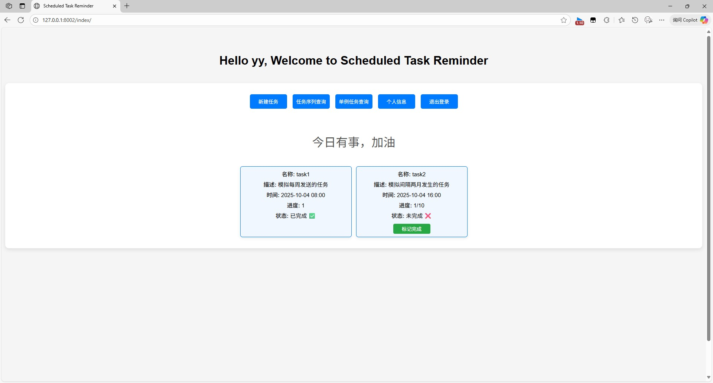
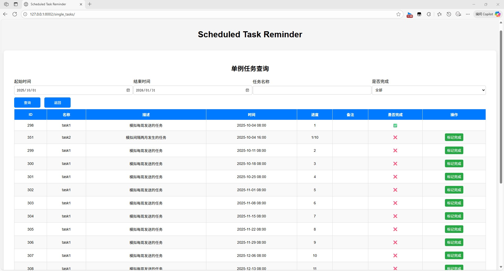

周期任务提醒

使用fastapi后端, mysql数据库

### **⚠️ 未对高负载场景做优化，在高负载场景下的运行稳定性还需测试**

----
### 如何运行
```shell
uv sync
```
初始化数据库配置
```shell
aerich init -t app.models.mysql_config.MYSQL_TORTOISE_ORM
```
初始化数据库
```shell
aerich init-db
```
在根目录创建.env文件, 
```python
SMTP_SERVER=    # smtp 服务器
SMTP_PORT=      # smtp 端口号
SMTP_USER=      # smtp 邮箱
SMTP_PASSWORD=  # smtp 密码

SQL_HOST=       # mysql ip地址
SQL_PORT=       # mysql 端口号
SQL_USER=       # mysql 用户名
SQL_PASSWORD=   # mysql 密码
SQL_DATABASE=   # mysql 数据库名称
```

----
### 页面预览



