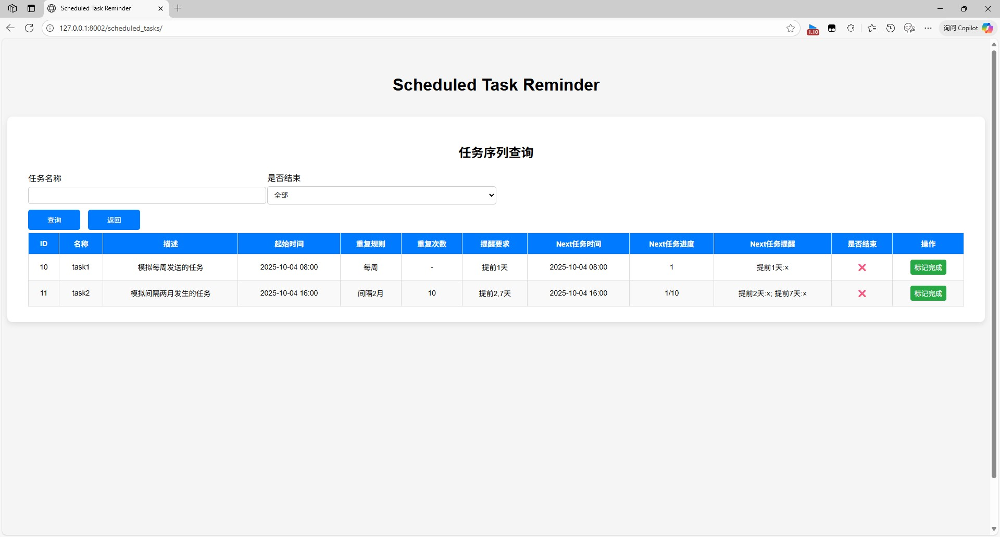

## 周期任务提醒

### 使用fastapi后端, mysql数据库

### **⚠️ 未对高负载场景做优化，在高负载场景下的运行稳定性还需测试**

----
### 如何运行
在根目录创建 .env 文件
```env
# smtp方式发送邮件功能已取消，改为outlook
# SMTP_SERVER=smtp.qq.com    # smtp 服务器
# SMTP_PORT=465      # smtp 端口号
# SMTP_USER=USER@qq.com      # smtp 邮箱
# SMTP_PASSWORD=PASSWORD  # smtp 密码
# SQL_HOST=localhost       # mysql ip地址

SQL_PORT=3306       # mysql 端口号
SQL_USER=root       # mysql 用户名
SQL_PASSWORD=123   # mysql 密码
SQL_DATABASE=scheduled_task_reminder   # mysql 数据库名称
```
下载环境
```shell
uv sync
```
激活环境
```shell
# cmd
.venv\Scripts\activate

# powershell
Set-ExecutionPolicy -Scope Process -ExecutionPolicy Bypass
.\.venv\Scripts\Activate.ps1
```
初始化数据库配置
```shell
aerich init -t app.models.mysql_config.MYSQL_TORTOISE_ORM
```
初始化数据库
```shell
aerich init-db
```
运行
```shell
uv run uvicorn app.main:app --reload --host 0.0.0.0 --port 8002
```

----
### 页面预览




